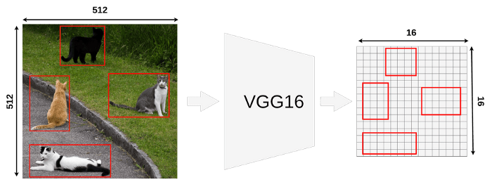

# ROI POOLING using Keras < 2.0 based on the tutorial here: https://towardsdatascience.com/understanding-region-of-interest-part-1-roi-pooling-e4f5dd65bb44

Requirements: 
              OpenCV-Python, 
              Keras < 2.0, 
              scikit_learn 

